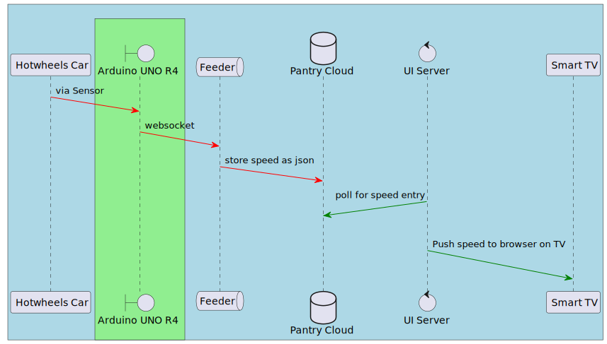

# Arduino Speed-o-meter

Arduino code to measure speed using IR sensors and feed the speed to [Feeder](https://github.com/MurlidharVarma/feeder) via websocket connection.



## Components Repositories
1. [Arduino Speedometer Code](https://github.com/MurlidharVarma/arduino)
1. [Feeder](https://github.com/MurlidharVarma/feeder)
1. [UI Server](https://github.com/MurlidharVarma/json-store-ui)

## Overview

There are 2 IR Sensors placed at fixed distance (30cm). The code starts a Timer  when a car crosses the IR Sensor(Left) and stops when car cross IR Sensor(Right). 

```
Distance = 30 cm
Time car took to cover the distance = Recorded by Arduino between 2 IR sensor detection

Speed = Distance / Time
```


#### Circuit diagram


#### Schematics


## Code Components
You need to install ArduinoGraphics library. This can be done in Arduino IDE > Tools > Manage Libraries

| File                         | Description                                                                                                                                                                                                                                                                                                           |
|------------------------------|-----------------------------------------------------------------------------------------------------------------------------------------------------------------------------------------------------------------------------------------------------------------------------------------------------------------------|
| /libraries/WifiConnect       | Enables connection to your local Wifi                                                                                                                                                                                                                                                                                 |
| /libraries/WebSock           | Enable websocket connection to a given server resource                                                                                                                                                                                                                                                                |
| /Speedometer/Speedometer.ino | Main file that houses all the logic to Speedometer. Main functions are listed below  1. Connects to Wifi  2. Connects to Websocket Server  3. Initiates IR Sensors and provide indication via LED indicator when ready  4. Records time to cover the distance and calculates Speed  5. Send Speed to Websocket Server |
| /Speedometer/secret.h        | Requires user to input WIFI SID, WIFI Password and WebSocket Server IP (local IP)                                                                                                                                                                                                                                     |

P.S. You can ignore all other files except the ones listed above.

## Usage

### Step 1: Install ArduinoGraphics library
Open Arduino IDE > Tools > Manage Libraries > Search ``ArduinoGraphics`` > Install

### Step 2: Copy Supporting Libraries
Copy the folders ``libraries/WebSock`` and ``libraries/WifiConnect`` to your Arduino IDE Library

### Step 3: Provide supporting info
Edit the file ``Speedometer/secret.h`` with WIFI SID, WIFI Password, and local IP address of [Feeder WebSocket Server](https://github.com/MurlidharVarma/feeder)

### Step 4: Load Program
Compile and Load Speedometer.ino program to Arduino UNO R4 Wifi
