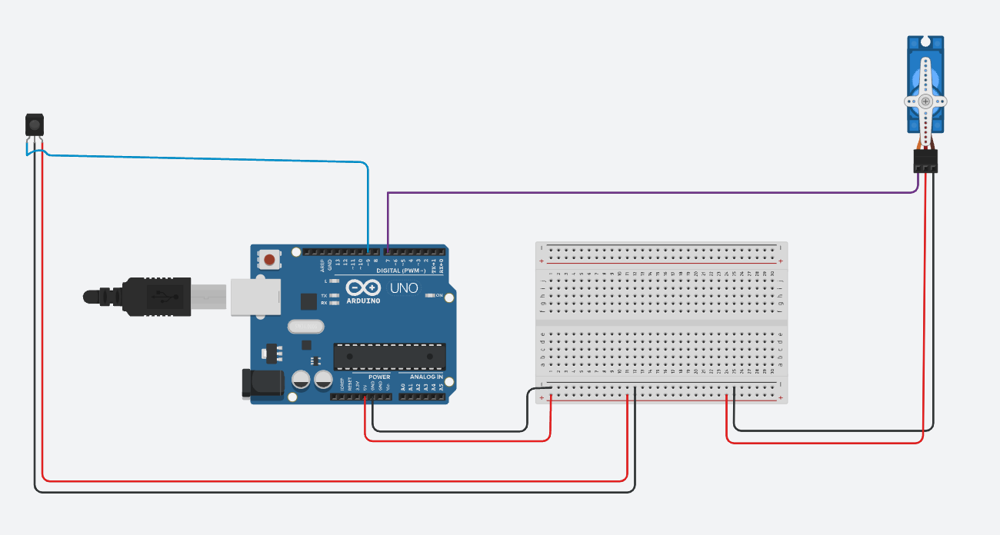
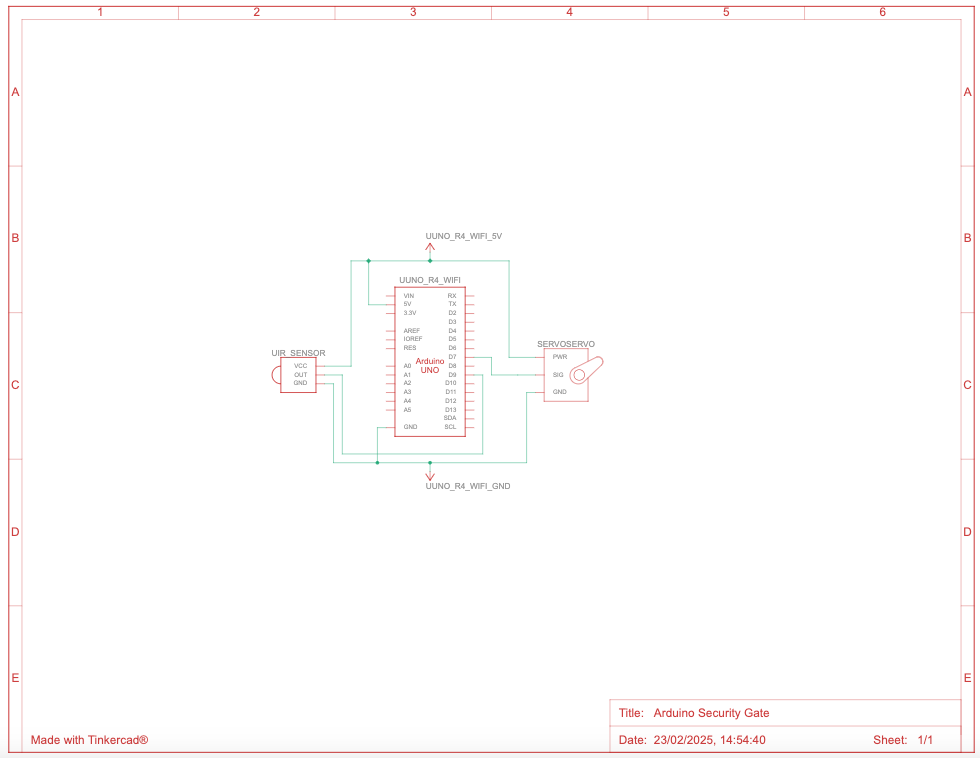

# Automated Security Gate

Simple Security Gate that uses Arduino, Servo Motor and IR sensor/

| Element | Description |
|---------  | ----------- |
| Servo motor | Attached to the gated bar that lifts up to let the car pass |
| IR sensor | To detect presence of car that has arrived near the gate |
| Arduino | To interact with IR sensor, detect car and accordingly instruct servo motor to open / close gated bar|

## Circuit Diagram

## Schematics
